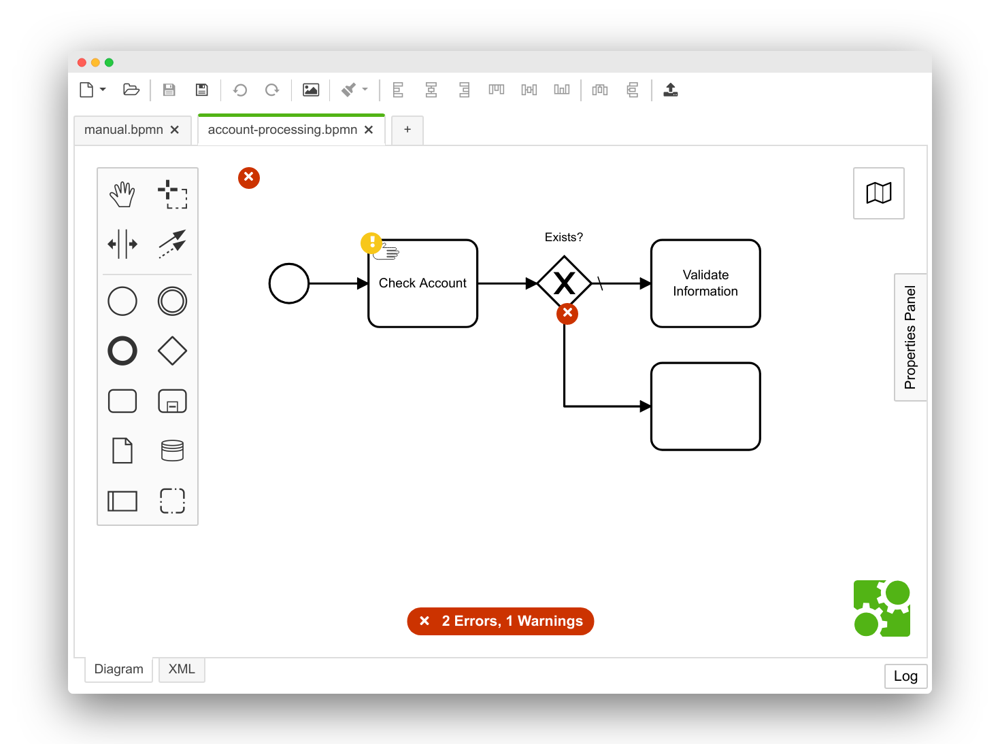
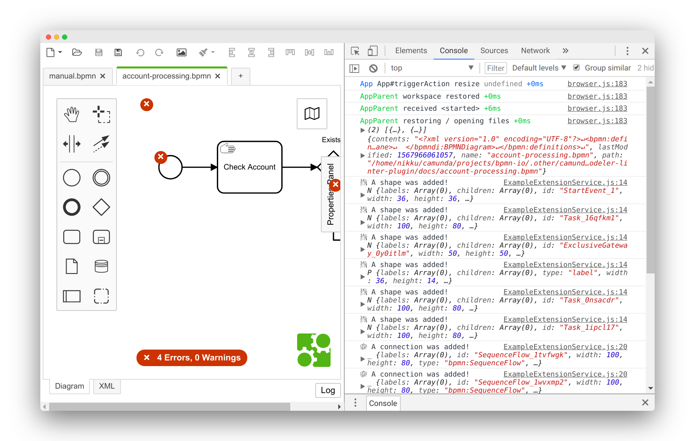

# Extending the Camunda Modeler

Auxiliary resources for the workshop _Extending the Camunda Modeler for Fun and Profit_, helt at [CamundaCon 2019](https://www.camundacon.com/).


## Workshop Goals

The goal of this workshop is to integrate [diagram validation](https://github.com/camunda/camunda-modeler-linter-plugin) into the Camunda Modeler and implement our own plug-in that contributes custom validation rules.

More specific, we set out to accomplish the following:

* Install [Camunda Modeler Linter plug-in](https://github.com/camunda/camunda-modeler-linter-plugin)
* Create own Camunda Modeler plug-in
* Setup for plug-in development
* Create [bpmnlint plug-in](https://github.com/bpmn-io/bpmnlint-plugin-example)
* Integrate bpmnlint plug-in with our Camunda Modeler plug-in
* Write our own validation rules: No user tasks and external tasks only


## Prerequisites

### Verify

* You have an appropriate command line set up (__NO `cmd`__ but something like [`git-bash`](https://www.atlassian.com/git/tutorials/git-bash) on Windows)
* You've [downloaded the Camunda Modeler](https://camunda.com/download/modeler/)
* You have [Node.js](https://nodejs.org/en/) (LTS or higher) installed
* You have an editor / IDE suitable for JavaScript development

### Expected Results

* You can open the Camunda Modeler
* You can retrieve versions of `node`, `npm` and `npx` via the command line:
    ```
    node -v
    npm -v
    npx -v
    ```


## Step 0: Install Linter Plug-in

### Instructions

Within the Camunda Modeler `resources/plugins` directory (cf. [plug-in search paths](https://github.com/camunda/camunda-modeler/tree/develop/docs/plugins#plugging-into-the-camunda-modeler)) execute:

```sh
npx degit github:camunda/camunda-modeler-linter-plugin camunda-modeler-linter-plugin
```

As an alternative to the above command, you may download the plug-in from GitHub and unpack it manually, too.

Restart the Camunda Modeler.

### Expected Results

* The [Linter plug-in](https://github.com/camunda/camunda-modeler-linter-plugin) is downloaded and unpacked to the `resources/plugins/camunda-modeler-linter-plugin` directory.
* After restarting the Camunda Modeler validation controls show up when opening a BPMN diagram:
    


## Step 1: Play Around with the Plug-in

### Instructions

You got a local BPMN diagram? Open the diagram.

Activate the linting mode by clicking the lint result overlay and see how validation kicks in.

### Expected Results

* Linter errors and warnings show up on the diagram. Or your diagram is bullet-proof already!
   


## Step 2: Create a Project Directory to Work in

### Instructions

The linter plug-in has a [documented extension point](https://github.com/camunda/camunda-modeler-linter-plugin#overriding-provided-rules) to override the provided lint rules with custom ones.

We will create our own plug-in that provides our own, custom rules to the app.

To start, create the directory `camunda-modeler-workshop` and work from there in the next steps.

```
mkdir camunda-modeler-workshop
cd camunda-modeler-workshop
```


## Step 3-7: Setup to Create your Own Linter Rules

> This roughly resembles steps [three](#step-3-generate-your-own-camunda-modeler-plug-in), [four](#step-4-link-your-plug-in-with-the-camunda-modeler), [five](#step-5-allow-rules-to-be-packed-with-the-plug-in), [six](#step-6-create-your-bpmnlint-rules-extension), and [seven](#step-7-integrate-custom-lint-rules-with-our-plug-in). 
> 
> If you are new to JavaScript and/or Camunda Modeler plug-in development, take this route.

### Instructions

The linter plug-in [offers an extension point](https://github.com/camunda/camunda-modeler-linter-plugin#overriding-provided-rules) to contribute your own lint rules. We create our own plug-in that uses this extension point to contribute validation rules to the app.

Within the `camunda-modeler-workshop` directory, download and setup the [Custom Linter Rules plug-in](https://github.com/camunda/camunda-modeler-custom-linter-rules-plugin):

```sh
npx degit github:camunda/camunda-modeler-custom-linter-rules-plugin custom-linter-rules
```

Setup the plug-in:

```sh
cd custom-linter-rules
npm install
```

Spawn the plug-in in development setup to automatically re-build it on every change:

```sh
npm run dev
```

Follow the [development setup](https://github.com/camunda/camunda-modeler-plugin-example#development-setup) hints and link your plug-in to the Camunda Modeler `resources/plugins` directory via a symbolic link. This ensures the editor recognizes changes you make to the plug-in, as you develop.

Restart the Camunda Modeler to make it recognize the new plug-in.

### Expected Behavior

* The plug-in is checked out in the `camunda-modeler-workshop/custom-linter-rules` directory
* The plug-in contains a `.bpmnlintrc` that configures our used [bpmnlint rules]()
    ```json
    {
      "extends": [
        "bpmnlint:recommended",
        "plugin:custom/recommended"
      ],
      "rules": {
        "label-required": "off",
        "custom/no-manual-task": "warn"
      }
    }
    ```
* The plug-in ships with a bpmnlint extension that implements a `no-manual-task` rule in the file `bpmnlint-plugin-custom/rules/no-manual-task.js`
* Modeling a manual task in the Camunda Modeler triggers a warning:
    


## Step 3: Generate Your Own Camunda Modeler Plug-in

### Instructions

We'll create a new plug-in in the directory `camunda-modeler-workshop/camunda-modeler-plugin-custom`.

```
npx create-camunda-modeler-plugin custom
```

Alternatively you may clone or download the [example plug-in](https://github.com/camunda/camunda-modeler-plugin-example) directly from GitHub, too.

Next up, we create post download steps to install plug-in dependencies and spawn it in `dev` mode.

```
cd camunda-modeler-plugin-custom
npm install
npm run dev
```

### Expected Results

* The above steps completed successfully
* The `camunda-modeler-workshop/camunda-modeler-plugin-custom` directory contains your modeler plug-in.


## Step 4: Link your Plug-in with the Camunda Modeler

### Instructions

Follow the [Development Setup](https://github.com/camunda/camunda-modeler-plugin-example#development-setup) hints and link your plug-in to the Camunda Modeler `resources/plugins` directory via a symbolic link.

Restart the Camunda Modeler. Open the developer console via `F12`. Create a BPMN element via the palette.

### Expected Results

* The `Plugins` menu shows a `custom Plug-in` entry
* Inside the developer tools you see additional log output that a shape got added
    


## Step 5: Allow Rules to be Packed with the Plug-in

### Instructions

The linter plug-in [offers a way](https://github.com/camunda/camunda-modeler-linter-plugin#overriding-provided-rules) how we can configure used linter rules and provide our own rules. Lets use this to get rid of the annoying label required rule.

Within the `camunda-modeler-plugin-custom` directory, install the [bpmnlint-loader](https://github.com/nikku/bpmnlint-loader).

```sh
npm install bpmnlint bpmnlint-loader --save-dev
```

Extend the `webpack.config.js` [as documented](https://github.com/nikku/bpmnlint-loader#usage) to use the loader to consume [bpmnlint configuration files](https://github.com/bpmn-io/bpmnlint#configuration).

Create a `.bpmnlintrc` file, describing our configured rules in the `client` directory like this:

```json
{
  "extends": [
    "bpmnlint:recommended"
  ],
  "rules": {
    "label-required": "off"
  }
}
```

Replace your `client/index.js` file with the one [documented](https://github.com/camunda/camunda-modeler-linter-plugin#overriding-provided-rules).

Restart your plug-in development build

```
npm run dev
```

Go into the Camunda Modeler and reload it by pressing `CtrlOrCmd+R` within the development tools.


### Expected Behavior

* The label required rule is disabled in the Modeler
    


## Step 6: Create your BPMNLint Rules Extension

### Instructions

The Camunda Modeler linter plug-in uses [bpmnlint](https://github.com/bpmn-io/bpmnlint) under the hood.

To create our own rules, generate a rule extension project from within the `camunda-modeler-workshop` directory.

```
npx create-bpmnlint-plugin custom

cd bpmnlint-plugin-custom
npm install
npm test
```

This generated the extension in the `bpmnlint-plugin-custom` sub-directory.

### Expected Results

* The above steps completed successfully
* The `camunda-modeler-workshop/bpmnlint-plugin-custom` directory contains your bpmnlint plug-in.


## Step 7: Integrate Custom Lint Rules with our Plug-in

### Instructions

Within the `camunda-modeler-plugin-custom` directory, link the local plug-in:

```
npm install bpmnlint-plugin-custom@file:../bpmnlint-plugin-custom
```

Update the `.bpmnlintrc` file to enable the `custom/no-manual-task` rule:

```json
{
  "extends": [
    "bpmnlint:recommended"
  ],
  "rules": {
    "label-required": "off",
    "custom/no-manual-task": "error"
  }
}
```

Reload the Camunda Modeler.

Model a manual task.

### Expected Results

* The linter warns you when modeling the manual task
    


## Step 8: Go Wild and Create your Own Rules

### Instructions

A couple of ideas what to do next:

* Copy the `no-manual-task` rule to warn on user tasks. We want to avoid them during black-box processing.
* Debug rule evaluation, dig into elements that are being validated and the properties the BPMN meta-model exposes.
* Can you create a rule that warns on all but external tasks for implementing work with the engine?

### Plug-in Development Tips

* Inside the Camunda Modeler, open the developer console via `F12`.
* Press `CmdOrCtrl + R` within the developer console to reload the app. This will make it aware of any linked plug-in changes.
* Use the debugger built into the developer console (cf. `Source` tab) to investigate the inner workings of your plug-ins.


## License

This work is licensed under a <a rel="license" href="http://creativecommons.org/licenses/by/4.0/">Creative Commons Attribution 4.0 International License</a>.
